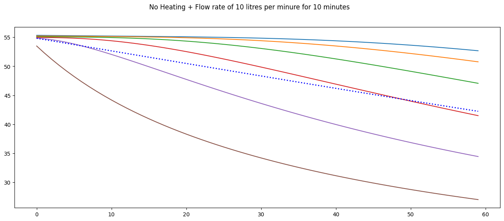

cylinder
================

<!-- WARNING: THIS FILE WAS AUTOGENERATED! DO NOT EDIT! -->

This file will become your README and also the index of your
documentation.

## Install

``` sh
pip install cylinder
```

This basic model provides the core function for a step change
calculation in a mixed hot water cylinder

## How to use

Load some data that can be used to test the model - flow and electricity
pricing

``` python
# df = (pd.DataFrame(load_demand(path = Path('../data/drawprofiles'),bed=5,unit=4)))
# df.columns=["flow"]
# df = df.merge(load_power(path = Path('../data')), how='left', left_index=True, right_index=True)
# df.head()
```

Create a hot water cylinder object and initialise it with the data

``` python
hwc = HWC(T_set=70, T_deadband=2, element=3, radius=.2, height=1.5)
```

``` python
print(f'The HWC volume is {int(hwc.volume*1000)} liters')
print(f'The HWC surface area is {hwc.surface_area:.2f} m2')
print(f'The HWC has a {hwc.element:.2f} kW element')
```

    The HWC volume is 188 liters
    The HWC surface area is 2.14 m2
    The HWC has a 3.00 kW element

Default thermogram

Run the model for a single day on thermostat and plot the results

``` python
hwc = HWC(T_set=55, T_deadband=1.2, element=3, radius=.2, height=1.5)
```

``` python
env = HWC(T_set=55, element=3, delta=10000, nodes=6)
shower = .31 # 10 litres per minute
temp = []
for step in range(60):
    action = 0 #np.random.randint(0,2)
    env._update_model(action = action , flow = shower )#if step < 10 else 0)
    temp.append(env.temperatures)

fig, ax = plt.subplots(figsize=(16,6))
ax.plot(np.vstack(temp))
ax.plot(np.vstack(temp).mean(axis=1), lw=2, ls=':', c='blue')

fig.suptitle('No Heating + Flow rate of 10 litres per minure for 10 minutes')
```

    Text(0.5, 0.98, 'No Heating + Flow rate of 10 litres per minure for 10 minutes')



``` python
# fig, ax = plt.subplots(nrows=2, figsize=(12,6), sharex=True)
# ax[0].plot(results.temperature)
# # ax[1].plot(results['flow']*100)
# ax[0].set_ylabel('°C')
# ax[0].set_title('Temperature')
# ax[1].plot(results['thermostat'])
# ax[1].xaxis.set_major_formatter(mdates.DateFormatter("%H:%M"))
# ax[1].xaxis.set_minor_formatter(mdates.DateFormatter("%H:%M"))
```

``` python
# print(f'The element was on for {results.thermostat.sum()} minutes.')
# print(f'Power consumption was {results.thermostat.sum()/60*hwc.element:.2f} kWh.')
```

    The element was on for 129 minutes.
    Power consumption was 6.45 kWh.

# Passive Cooling
