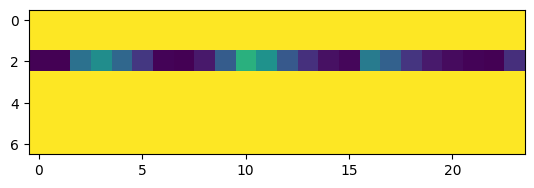
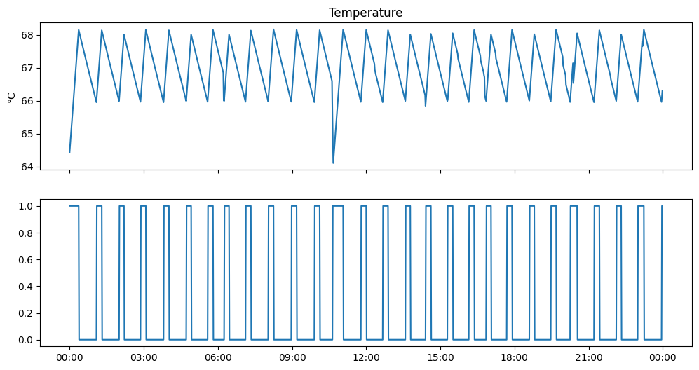
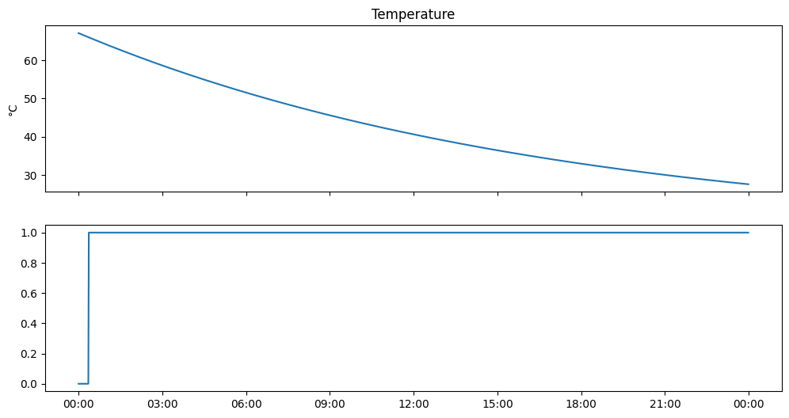
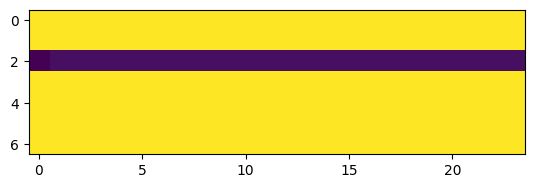

cylinder
================

<!-- WARNING: THIS FILE WAS AUTOGENERATED! DO NOT EDIT! -->

This file will become your README and also the index of your
documentation.

## Install

``` sh
pip install cylinder
```

This basic model provides the core function for a step change
calculation in a mixed hot water cylinder

## How to use

Load some data that can be used to test the model - flow and electricity
pricing

``` python
df = (pd.DataFrame(load_demand(path = Path('../data/drawprofiles'),bed=3,unit=3)))
df.columns=["flow"]
df = df.merge(load_power(path = Path('../data')), how='left', left_index=True, right_index=True)
df.head()
```

<div>
<style scoped>
    .dataframe tbody tr th:only-of-type {
        vertical-align: middle;
    }

    .dataframe tbody tr th {
        vertical-align: top;
    }

    .dataframe thead th {
        text-align: right;
    }
</style>
<table border="1" class="dataframe">
  <thead>
    <tr style="text-align: right;">
      <th></th>
      <th>flow</th>
      <th>price</th>
      <th>price_kw</th>
      <th>date</th>
      <th>week</th>
      <th>hour</th>
      <th>day</th>
      <th>peak</th>
      <th>tou</th>
      <th>cost</th>
      <th>n_cost</th>
      <th>sr_cost</th>
      <th>lr_cost</th>
    </tr>
    <tr>
      <th>timestamp</th>
      <th></th>
      <th></th>
      <th></th>
      <th></th>
      <th></th>
      <th></th>
      <th></th>
      <th></th>
      <th></th>
      <th></th>
      <th></th>
      <th></th>
      <th></th>
    </tr>
  </thead>
  <tbody>
    <tr>
      <th>2020-01-01 00:00:00</th>
      <td>0.0</td>
      <td>7.920</td>
      <td>0.007920</td>
      <td>2020-01-01</td>
      <td>1</td>
      <td>0</td>
      <td>2</td>
      <td>0</td>
      <td>0.02</td>
      <td>0.027920</td>
      <td>-0.22080</td>
      <td>0.162438</td>
      <td>0.149272</td>
    </tr>
    <tr>
      <th>2020-01-01 00:01:00</th>
      <td>0.0</td>
      <td>8.526</td>
      <td>0.008526</td>
      <td>2020-01-01</td>
      <td>1</td>
      <td>0</td>
      <td>2</td>
      <td>0</td>
      <td>0.02</td>
      <td>0.028526</td>
      <td>-0.21474</td>
      <td>0.158675</td>
      <td>0.145694</td>
    </tr>
    <tr>
      <th>2020-01-01 00:02:00</th>
      <td>0.0</td>
      <td>9.132</td>
      <td>0.009132</td>
      <td>2020-01-01</td>
      <td>1</td>
      <td>0</td>
      <td>2</td>
      <td>0</td>
      <td>0.02</td>
      <td>0.029132</td>
      <td>-0.20868</td>
      <td>0.155010</td>
      <td>0.142235</td>
    </tr>
    <tr>
      <th>2020-01-01 00:03:00</th>
      <td>0.0</td>
      <td>9.738</td>
      <td>0.009738</td>
      <td>2020-01-01</td>
      <td>1</td>
      <td>0</td>
      <td>2</td>
      <td>0</td>
      <td>0.02</td>
      <td>0.029738</td>
      <td>-0.20262</td>
      <td>0.151437</td>
      <td>0.138888</td>
    </tr>
    <tr>
      <th>2020-01-01 00:04:00</th>
      <td>0.0</td>
      <td>10.344</td>
      <td>0.010344</td>
      <td>2020-01-01</td>
      <td>1</td>
      <td>0</td>
      <td>2</td>
      <td>0</td>
      <td>0.02</td>
      <td>0.030344</td>
      <td>-0.19656</td>
      <td>0.147952</td>
      <td>0.135645</td>
    </tr>
  </tbody>
</table>
</div>

Create a hot water cylinder object and initialise it with the data

``` python
hwc = HWC(T_set=68, T_deadband=2, element=3000, radius=.25, height=1)
```

``` python
print(f'The HWC volume is {int(hwc.Volume*1000)} liters')
```

    The HWC volume is 196 liters

Default thermogram

``` python
plt.imshow(hwc.thermogram)
```

    <matplotlib.image.AxesImage>


Run the model for a single day on thermostat and plot the results

``` python
results = []

for index, row in df[:24*60].iterrows():
  raw_flow = row['flow']
  hwc.flow = raw_flow*(hwc.T_demand-hwc.T_cold)/(hwc.T-hwc.T_cold)
  hwc._thermostat()
  hwc.T = hwc._update_temperatures(action=1)
  results.append([index,hwc.T, hwc.thermostat, hwc.flow,row.cost])
  r,c = row.day, row.hour
  hwc.thermogram[r,c] = hwc.thermostat * 1 * hwc.Q /60 + hwc.thermogram[r,c]*(1- 0.1)

results = pd.DataFrame(results, columns=['time','T','thermostat','flow','cost']).set_index('time')
```

``` python
plt.imshow(hwc.thermogram)
```

    <matplotlib.image.AxesImage>



``` python
fig, ax = plt.subplots(nrows=2, figsize=(12,6), sharex=True)
ax[0].plot(results['T'])
ax[0].set_ylabel('°C')
ax[0].set_title('Temperature')
ax[1].plot(results['thermostat'])
ax[1].xaxis.set_major_formatter(mdates.DateFormatter("%H:%M"))
ax[1].xaxis.set_minor_formatter(mdates.DateFormatter("%H:%M"))
```



# Passive Cooling

``` python
hwc = HWC(T_set=68, T_deadband=2, element=3000, radius=.25, height=1)
results = []
for index, row in df[:24*60].iterrows():
  raw_flow = 0
  hwc.flow = raw_flow*(hwc.T_demand-hwc.T_cold)/(hwc.T-hwc.T_cold)
  hwc._thermostat()
  hwc.T = hwc._update_temperatures(action=0)
  results.append([index,hwc.T, hwc.thermostat, hwc.flow,row.cost])
  r,c = row.day, row.hour
  hwc.thermogram[r,c] = hwc.thermostat * 1 * hwc.Q /60 + hwc.thermogram[r,c]*(1- 0.1)
results = pd.DataFrame(results, columns=['time','T','thermostat','flow','cost']).set_index('time')
```

``` python
fig, ax = plt.subplots(nrows=2, figsize=(12,6), sharex=True)
ax[0].plot(results['T'])
ax[0].set_ylabel('°C')
ax[0].set_title('Temperature')
ax[1].plot(results['thermostat'])
ax[1].xaxis.set_major_formatter(mdates.DateFormatter("%H:%M"))
ax[1].xaxis.set_minor_formatter(mdates.DateFormatter("%H:%M"))
```



``` python
plt.imshow(hwc.thermogram)
```

    <matplotlib.image.AxesImage>


